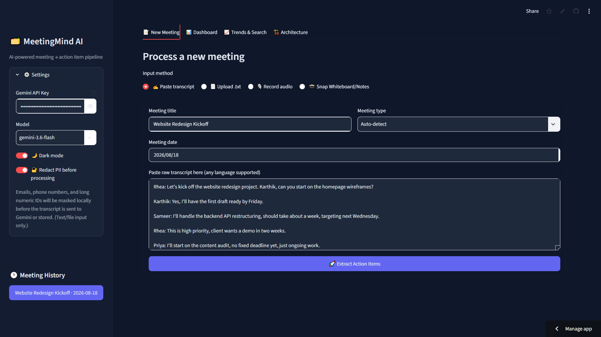
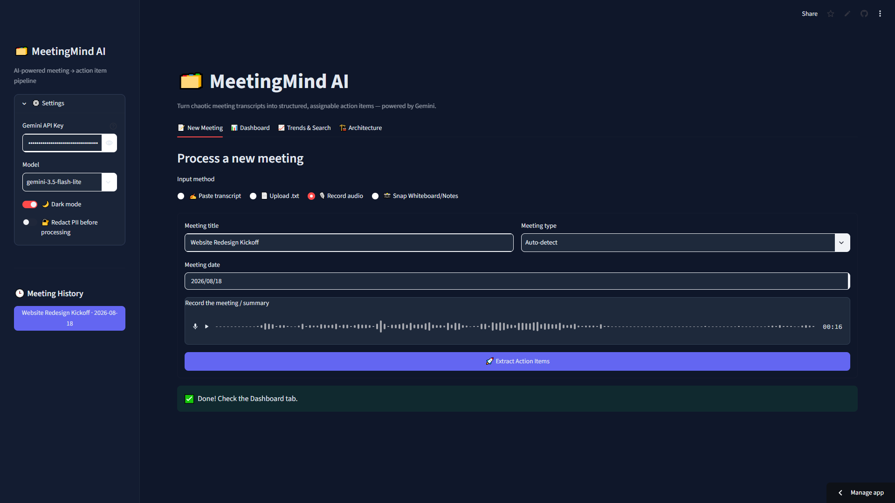
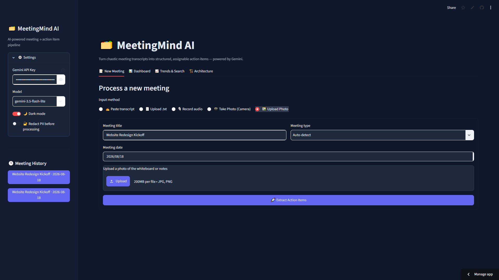
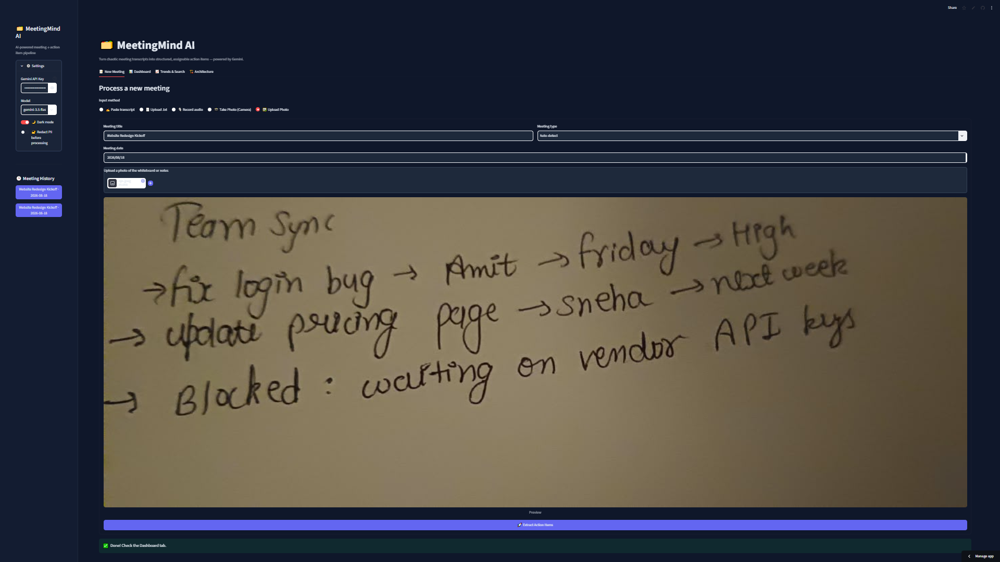
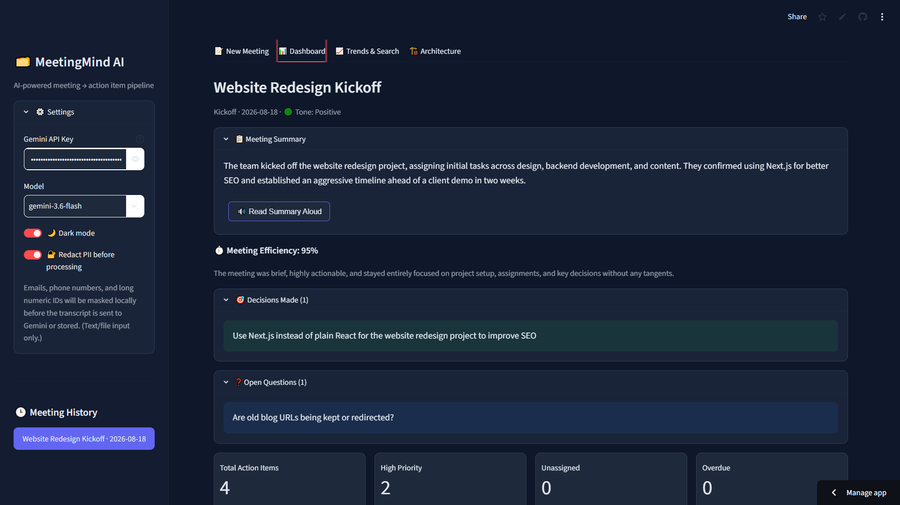
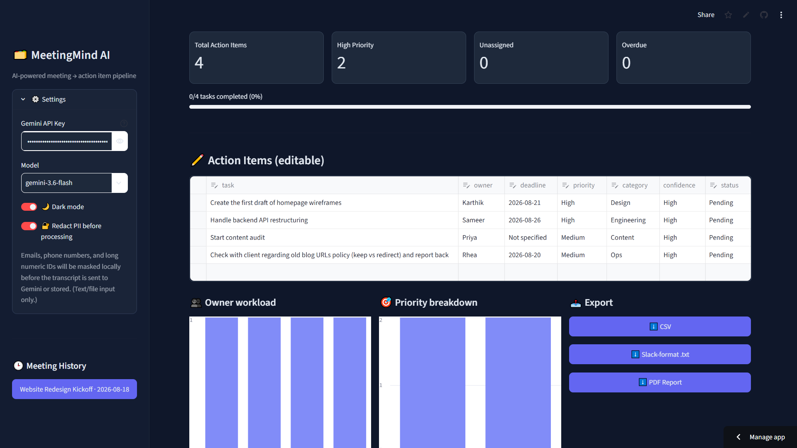
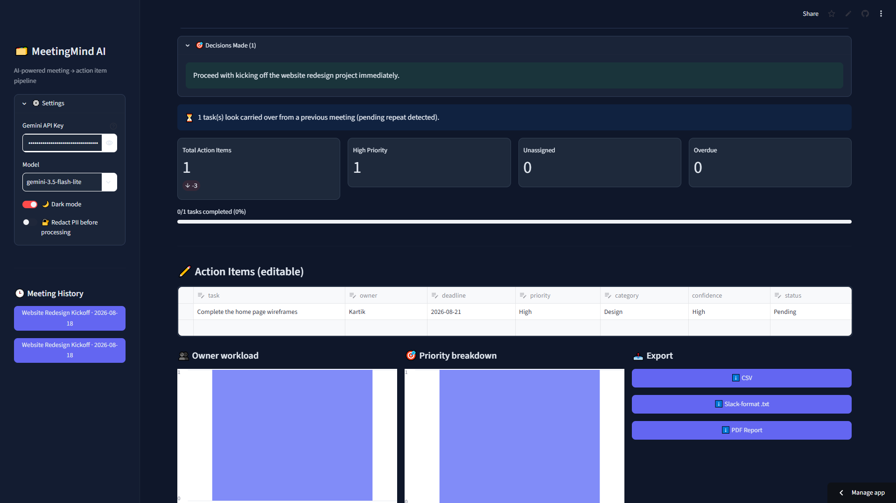
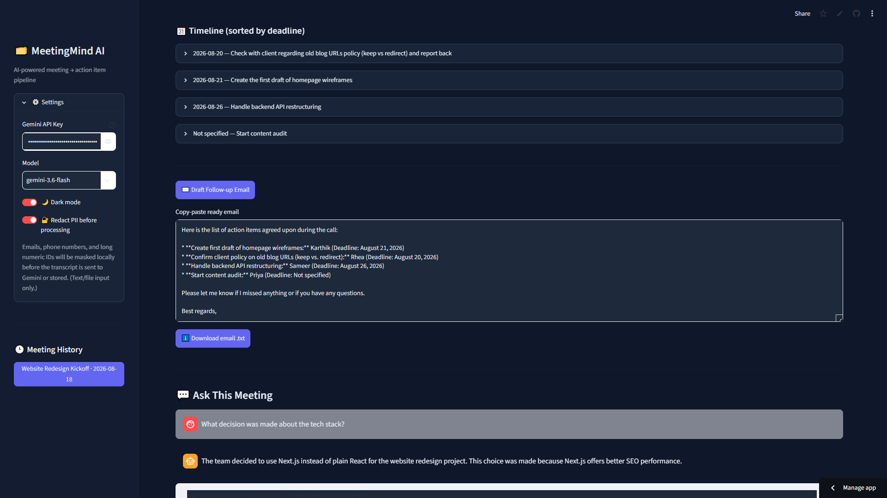

# 🗂️ MeetingMind AI
### AI-Powered Meeting Intelligence & Productivity Platform

> Turn chaotic meeting transcripts, recordings, or whiteboard photos into structured, assignable action items — powered by Google Gemini.

🔗 **Live App:** https://meeting-mind-ai-nbj74dhgw4jqravquwp4jf.streamlit.app/
🎓 **Built for:** MirAI School of Technology — AI Builder Virtual Summer Internship 2026 Capstone
👩‍💻 **Author:** Aarti Yadav

---

## 🎯 What It Does

MeetingMind AI takes a raw meeting input — pasted text, an uploaded `.txt` file, a live audio recording, or a **photo of a whiteboard/sticky notes** — and uses Gemini's multimodal + JSON-mode capabilities to extract:

- ✅ **Structured action items** — task, owner, deadline, priority, and a self-reported confidence score
- ⏱️ **Meeting Efficiency Score** — how much of the discussion was actionable vs rambling, with reasoning
- 🟢🟡🔴 **Meeting Tone** — Positive / Neutral / Tense
- ⚠️ **Risks & Blockers** — automatically flagged
- 🎯 **Decisions Made** — explicit team decisions, separate from action items
- ❓ **Open Questions** — unresolved items flagged for follow-up
- 🌐 **Automatic language detection** — works on non-English transcripts too

It then gives you an editable dashboard, multi-meeting trend analytics, a Q&A chat grounded in the meeting, follow-up email drafting, and exports to CSV / Slack format / PDF.

---

## 🖼️ Screenshots

**New Meeting — Paste transcript with PII redaction**


**New Meeting — Record live audio**


**New Meeting — Upload a whiteboard photo**


**Whiteboard photo preview before extraction**


**Dashboard — Summary, tone, decisions & open questions**


**Dashboard — KPI cards, editable action items & charts**


**Dashboard — Decisions made & carried-over task detection**


**Dashboard — Timeline, follow-up email & Ask This Meeting chat**


---

## 🛠️ Tech Stack

| Layer | Technology |
|---|---|
| Frontend | Streamlit |
| AI | Google Gemini API (`google-genai` SDK, `gemini-3.6-flash`) |
| Data | Pandas |
| PDF Export | ReportLab |
| Architecture Diagram | Mermaid.js |
| Deployment | Streamlit Community Cloud |

---

## ✨ Features

### 📥 Input — 5 ways to feed a meeting in
- ✍️ Paste transcript directly
- 📄 Upload a `.txt` file
- 🎙️ Record live audio (Gemini transcribes + extracts in one call)
- 📸 Take a photo of a whiteboard/notes via camera
- 🖼️ Upload a photo from your device

### 🧠 AI Intelligence
- Single-call structured extraction (action items + tone + efficiency + risks + decisions + open questions) — keeps API usage efficient
- **"Ask This Meeting"** — grounded, multi-turn Q&A chat about a specific meeting
- ✉️ **Follow-up email generator** — one click, copy-paste ready
- 🔐 Optional local PII redaction — emails/phone numbers masked *before* they ever reach the API
- 🌐 Multilingual input support with English-normalized output

### 📊 Dashboard & Tracking
- Editable action-item table (`st.data_editor`) with priority/status/confidence
- KPI cards — total tasks, high priority, unassigned, overdue (with deltas)
- 👥 Owner workload chart, 🎯 priority breakdown chart, 🗓️ deadline timeline
- 🔄 **"What Changed Since Last Meeting"** — completed / still pending / newly raised
- ⏳ **Carried-over task detection** — flags repeat tasks across meetings (pure local logic, zero extra API cost)
- 🔊 Read summary aloud (browser text-to-speech, zero extra API cost)

### 📈 Trends & Search
- Multi-meeting analytics — tasks per meeting, efficiency trend line, workload across all meetings
- 🔍 Global task search by owner, keyword, or category

### 📤 Exports
- CSV, Slack-formatted text, and a branded PDF report

### 🌗 UI
- Dark/light mode toggle, clean indigo accent theme, responsive layout

---

## 🚀 Setup (Run Locally)

```bash
git clone https://github.com/Aarti-1209/Meeting-Mind-AI.git
cd Meeting-Mind-AI
pip install -r requirements.txt
```

Create `.streamlit/secrets.toml`:
```toml
GEMINI_API_KEY = "your-gemini-api-key"
```
Get a free key at [aistudio.google.com/apikey](https://aistudio.google.com/apikey)

Run:
```bash
streamlit run app.py
```

---

## 📁 Project Structure

Meeting-Mind-AI/
├── app.py # Streamlit UI — dashboard, tabs, exports, theming
├── gemini_engine.py # Gemini API wrapper — prompt engineering, extraction logic
├── requirements.txt
├── README.md
├── DESIGN.md
├── screenshots/ # App screenshots used in this README
└── .streamlit/
└── secrets.toml # not committed — API key lives here


---

## 🏗️ Architecture

**Data flow:**
User Input (text / file / audio / camera photo / uploaded photo)
↓
Optional local PII redaction (regex, no API call)
↓
Gemini API — single call, JSON-mode, system-prompted
↓
Structured JSON: action items, efficiency, tone, risks, decisions, open questions
↓
st.session_state (in-memory store)
↓
Dashboard → Carried-over detection → Export (CSV/Slack/PDF)
→ Follow-up Email (on-demand API call)
→ Ask This Meeting Q&A (on-demand API call)


Full data flow, prompt engineering strategy, and design rationale are documented in [DESIGN.md](./DESIGN.md). A live interactive architecture diagram is also available inside the app's **Architecture** tab.

---

## 📌 Known Limitations

- Session state is in-memory only — meeting history resets when the app restarts (no persistent database in this version)
- Carried-over detection uses text similarity, so semantically similar but very differently worded tasks may occasionally be missed
- PII redaction currently covers text/file input only, not audio or camera input

## 🔮 Future Improvements

- Persistent storage (SQLite/cloud DB) so history survives across sessions
- Dependency/impact graph between action items
- Slack/Calendar integration for direct task assignment

---

## 📄 License

Built as part of the MirAI School of Technology Capstone Project (2026).
